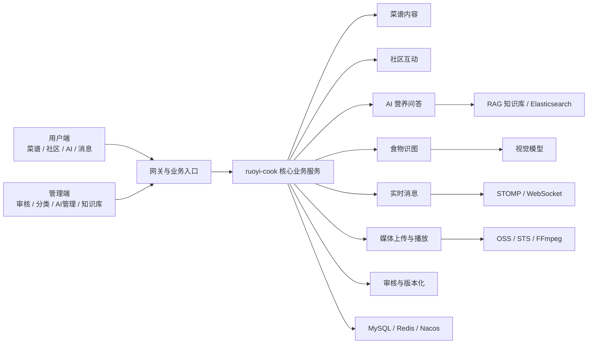

# 智慧食刻 WisdomCooking

智慧食刻是一个面向智慧饮食场景的全栈项目，围绕菜谱内容、社区互动、AI 辅助与后台治理构建完整平台能力。项目能力覆盖用户端、管理端与业务微服务，已落地 AI 问答、食物识图、OSS 分片上传、RAG 检索、实时消息和内容审核等核心链路。

当前公开仓库主要收录管理端、后端微服务和 SQL 脚本，用于项目展示、功能说明和工程交付。

详细版项目说明见 [docs/README-详细版.md](./docs/README-详细版.md)。

## 项目定位

- 面向用户侧：菜谱浏览与创作、社区互动、AI 营养问答、食物识图、消息沟通、打卡反馈
- 面向管理侧：内容审核、分类管理、AI 模型配置、知识库维护、日志查看
- 面向技术实践：RuoYi-Cloud 业务扩展、媒体上传转码、RAG 问答、多模态 AI 接入

## 核心亮点

- `OSS 分片上传`
  - H5 端通过 `sessionId + checkpointKey` 完成直传 OSS 与断点续传
  - 上传完成后进入后端校验与媒体入库流程
- `HLS 转码与播放代理`
  - 视频上传完成后异步转码为 HLS
  - 私有 Bucket 场景下由后端代理播放列表与分片访问
- `RAG 向量检索`
  - 知识文档切片后写入元数据与 chunk 映射
  - 基于 Spring AI `VectorStore` 和 Elasticsearch 实现检索增强问答
- `多模态 AI 能力`
  - 同时支持文本问答、SSE 流式输出与食物识图
  - 对话模型与视觉模型分开配置和调用
- `会话隔离`
  - AI 对话按 `conversationId` 聚合归档
  - 服务端校验会话归属，避免跨用户串会话
- `实时消息与内容治理`
  - REST 拉历史，STOMP 推实时消息
  - 菜谱版本化、社区先审后发、打卡转动态

## 技术栈

- 前端：Vue 3、Element Plus、TypeScript、Vite、uni-app
- 后端：RuoYi-Cloud、Spring Boot、Spring Cloud Alibaba、MyBatis、MapStruct、Spring AI
- 中间件：MySQL、Redis、Nacos、Elasticsearch、OSS、FFmpeg
- 实时与媒体：STOMP / WebSocket、`ali-oss`、`hls.js`、`video.js`

## 当前仓库内容

```text
WisdomCooking
├── ms_stu_pro371_admin_vue3      # 管理端：审核、分类、模型、知识库、日志
├── ms_stu_pro371_server_cloud    # 后端微服务：网关、认证、系统、ruoyi-cook
├── sql                           # 业务表与初始化 SQL
├── CONFIGURATION.md              # 本地配置说明
└── 开发内容文档.md                # 项目阶段性开发说明
```

## 页面展示

### 用户端首页


### 用户端 AI 页


### 管理端仪表盘


更多页面说明与完整截图说明见 [README 详细版](./docs/README-详细版.md)。

## 业务拓扑



## 适用场景

- 校园课程设计、毕业设计或全栈项目答辩展示
- 智慧饮食平台原型验证与业务流程演示
- AI + 内容社区 + 媒体上传播放的综合实践项目
- 基于 RuoYi-Cloud 扩展垂直业务微服务的参考样例

## 本地开发说明

- 管理端默认目录：`ms_stu_pro371_admin_vue3`
- 后端默认目录：`ms_stu_pro371_server_cloud`
- 网关默认端口：`8080`
- 业务服务默认端口：`9204` 或以本地配置为准
- 本地配置说明见 [CONFIGURATION.md](./CONFIGURATION.md)

## 补充说明

- 本仓库用于展示智慧食刻项目的核心工程结构与已落地能力。
- 若后续补齐用户端源码、完整项目文档和演示资源，可继续扩展仓库首页说明与目录结构。
