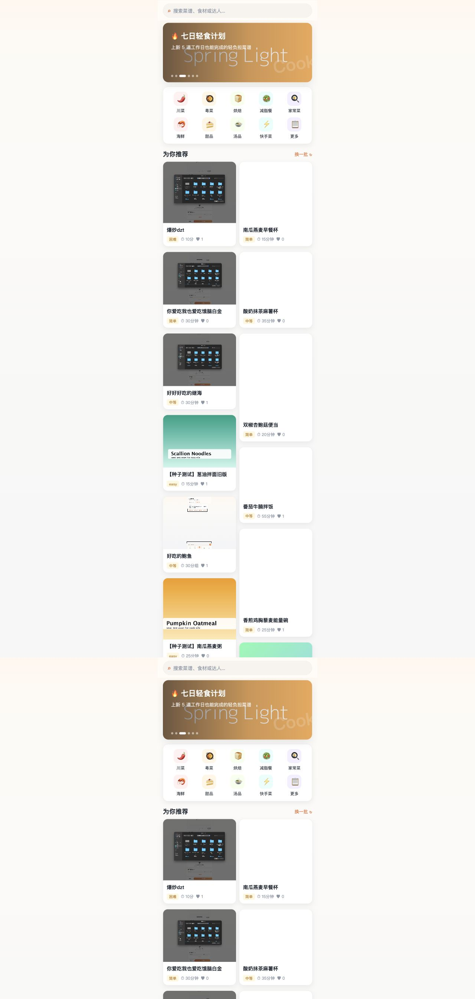
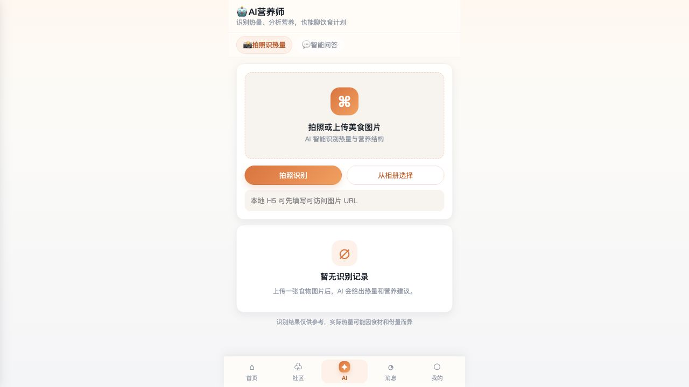
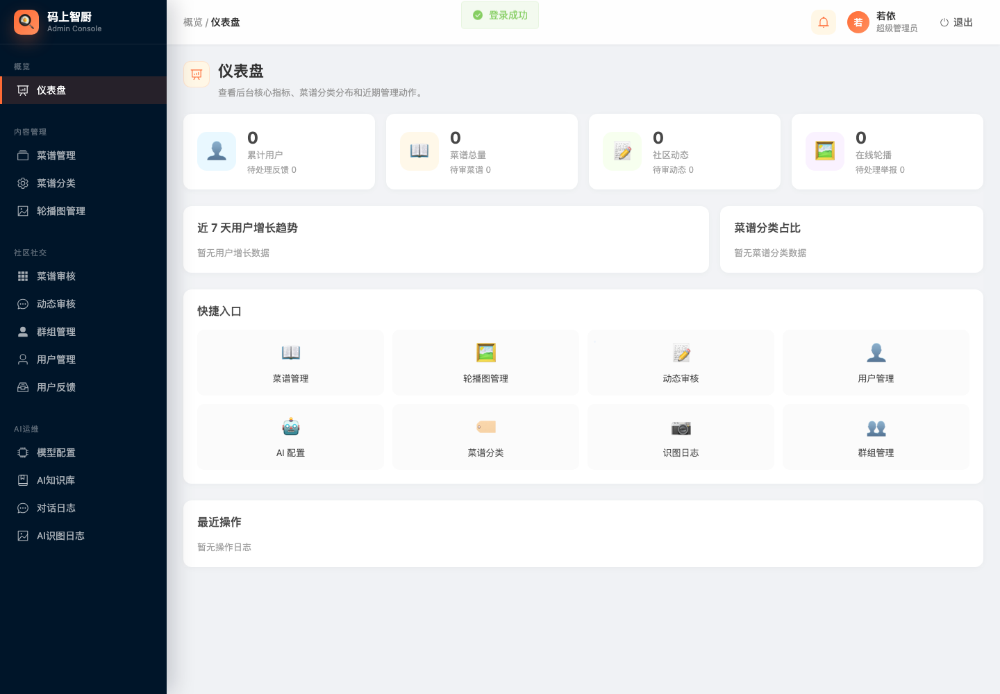
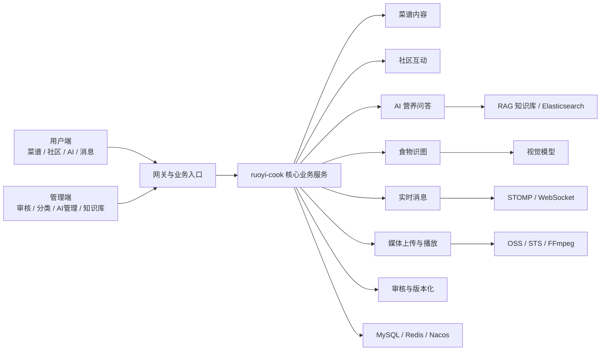

# 智慧食刻

智慧食刻是一个面向智慧饮食场景的全栈项目，围绕“菜谱内容 + 社区互动 + AI 辅助 + 后台治理”构建了一套完整的平台能力。项目当前由用户端 `user-app`、管理端 `admin-web` 和业务微服务 `ruoyi-cook` 组成，覆盖菜谱浏览与创作、社区发布与审核、AI 营养问答、食物识图、实时消息、媒体上传播放等核心链路。

## 项目简介

本项目定位为“智慧饮食 / 菜谱 / 社区 / AI 辅助”一体化平台。

用户侧可以完成菜谱浏览、搜索、发布、收藏、互动、打卡、AI 问答和食物识别；管理侧可以完成菜谱审核、动态审核、分类管理、AI 模型配置、知识库维护与日志查看；后端则基于 RuoYi-Cloud 体系承载业务 API、媒体处理、消息推送与 AI 能力编排。

它不是单一的页面演示项目，而是一个具备前后端协同、内容治理、媒体处理与 AI 集成能力的完整实践样例。

## 项目作用

### 面向用户侧

- 提供菜谱浏览、搜索、分类筛选与详情查看能力
- 支持用户创建菜谱、上传图文和视频内容
- 支持社区动态发布、点赞、收藏、评论、举报与关注
- 提供 AI 营养问答、食物图片识别与历史会话查看
- 提供私聊、群聊、通知等消息沟通能力
- 提供个人中心、打卡、反馈、兴趣标签等功能闭环

### 面向管理侧

- 提供菜谱审核、动态审核与分类管理
- 提供 AI 模型配置、AI 对话日志、识图日志管理
- 提供知识库文档维护与 AI 能力运维入口
- 提供用户、群组、轮播图等运营管理能力

## 适用场景

- 校园课程设计、毕业设计或全栈项目答辩展示
- 智慧饮食平台原型验证与业务流程演示
- AI + 内容社区 + 媒体上传播放的综合实践项目
- 基于 RuoYi-Cloud 扩展垂直业务微服务的参考样例

## 核心模块概览

### 用户端 `user-app`

基于 uni-app、Vue 3、Pinia、TypeScript 构建，负责用户实际使用场景，包含：

- 登录注册与个人资料维护
- 首页推荐、搜索、分类浏览
- 菜谱发布、详情、收藏、点赞
- 社区动态发布、评论、互动、审核状态查看
- AI 问答、流式回复、食物识图
- 私聊、群聊、通知消息
- 打卡、反馈、个人中心

### 管理端 `admin-web`

基于 Vue 3、Element Plus、Pinia、TypeScript 构建，负责平台管理能力，包含：

- 菜谱管理与审核
- 动态审核与分类管理
- AI 模型管理
- AI 对话日志与识图日志查看
- AI 知识库文档管理
- 用户、群组、轮播图等后台运营页面

### 业务后端 `ruoyi-cook`

基于 RuoYi-Cloud 微服务体系扩展的业务服务，负责：

- 用户端与管理端业务 API
- 菜谱、社区、打卡、消息、反馈等业务逻辑
- OSS 媒体上传会话管理与 HLS 转码链路
- AI 对话、流式输出、食物识图与 RAG 知识库检索
- 实时消息推送与后台审核治理

## 技术架构

### 前端

- `user-app`：uni-app、Vue 3、Pinia、uView Plus、TypeScript、Vite
- `admin-web`：Vue 3、Element Plus、Pinia、Vue Router、TypeScript、Vite
- 音视频相关：`video.js`、`hls.js`
- 实时通信：`@stomp/stompjs`
- OSS 上传：`ali-oss`

### 后端

- 微服务基础：RuoYi-Cloud、Spring Boot、Spring Cloud Alibaba
- 持久层：MyBatis、Mapper XML、Lombok、MapStruct
- AI 能力：Spring AI、DashScope
- 实时消息：Spring WebSocket、STOMP
- 文档调试：Knife4j

### 数据与中间件

- MySQL
- Redis
- Elasticsearch
- 阿里云 OSS / STS
- Nacos
- FFmpeg

## 项目亮点与实现方法

### 1. OSS 分片上传与断点续传

项目已实现 H5 端视频直传 OSS 的分片上传链路，而不是把大文件先传到业务后端再中转。

实现方式：

- 前端先调用后端初始化上传会话接口
- 后端返回 `sessionId`、对象 Key、分片参数和 STS 临时凭证
- H5 端使用 `ali-oss` 直接执行 multipart upload
- 前端通过 `checkpointKey` 在本地保存断点信息，实现刷新后续传
- 上传完成后再调用后端完成接口，由后端做对象校验和业务入库

这套方案降低了后端带宽与内存压力，也更适合较大视频文件的实际上传场景。

### 2. HLS 转码与私有桶播放代理

项目已实现视频上传后的异步转码链路，支持将原始视频处理为 HLS 播放资源。

实现方式：

- OSS 原片上传完成后，后端写入媒体记录并进入转码流程
- 后端异步调用 FFmpeg 生成 HLS 播放清单与分片文件
- 如果 OSS Bucket 为私有读，播放时不直接暴露原始分片地址
- 后端通过播放列表代理和分片代理接口输出可播放资源

这样既兼顾了视频播放体验，也兼顾了私有存储场景下的访问控制。

### 3. RAG 向量检索能力

项目已实现知识库增强问答能力，不是单纯把用户问题直接发送给大模型。

实现方式：

- 知识库文档先做分片处理
- 文档元数据、文档与 chunk 关系写入业务库
- 向量检索依赖 Spring AI `VectorStore`
- 当前向量检索能力接入 Elasticsearch
- AI 问答阶段会根据检索结果补充上下文，再生成回答
- 返回结果中可记录 `ragHit` 与来源信息，便于展示和追踪

这使得 AI 回答可以基于本地知识库进行增强，而不是完全依赖通用模型记忆。

### 4. AI 多模态能力栈

项目已实现文本问答与图像识别并存的多模态 AI 能力，而不是只提供单一聊天接口。

实现方式：

- 对话模型与视觉识别模型分开配置
- 文本问答支持普通响应和 SSE 流式输出两种模式
- 食物识图链路先上传图片，再调用识图接口完成识别分析
- 后端对会话消息、识图记录、模型配置都做了独立沉淀

这让平台既能回答饮食和营养问题，也能处理“拍照识别食物”的使用场景。

### 5. 基于 `conversationId` 的 AI 会话隔离

项目已实现 AI 会话按 `conversationId` 归档和隔离，避免不同用户或不同轮次问答互相串扰。

实现方式：

- 每轮对话都绑定到明确的 `conversationId`
- 服务端会校验当前会话是否属于当前用户
- 用户消息和助手消息按会话归档保存
- 前端可按会话查看历史记录、恢复上下文、删除会话

这套机制既保证了会话连续性，也保证了用户级数据隔离。

### 6. 实时消息模型

项目消息系统不是纯轮询，而是采用 REST + STOMP 的组合模式。

实现方式：

- REST 负责会话列表、历史消息、发消息、已读、会话设置等稳定读写操作
- STOMP 负责新消息与会话更新事件的实时推送
- 私聊、群聊、通知使用统一的会话模型进行组织

这种设计兼顾了数据一致性和实时体验，更贴近真实业务场景。

### 7. 内容审核与版本化机制

项目不只是“能发内容”，还实现了较完整的内容治理链路。

实现方式：

- 菜谱采用主表 + 版本表设计
- 已发布菜谱再次编辑时，生成新版本而不是直接覆盖线上内容
- 社区动态采用先审后发机制
- 打卡记录可生成待审核动态，形成业务联动
- 管理端提供对应审核页面和处理入口

这让项目不仅有前台交互能力，也具备平台型内容管理思路。

## 页面截图 / 系统演示图

以下截图来自当前仓库内的真实运行与联调记录，可用于展示系统的核心页面与整体完成度。

### 用户端首页



用户端首页聚合了轮播推荐、分类入口、推荐菜谱、推荐用户和热门关键词等内容，是智慧食刻面向终端用户的主要流量入口。

### 用户端 AI 营养师



AI 页面同时支持饮食问答、流式回复和食物识图，是项目多模态 AI 能力的核心展示页面之一。

### 用户端社区互动


社区页用于展示动态内容、互动行为和内容审核后的前台消费场景，体现了菜谱内容、社区互动和用户关系之间的联动。

### 管理端仪表盘



管理端提供内容审核、分类管理、AI 模型配置、知识库维护和日志查看等后台治理能力，是项目平台化能力的重要组成部分。

## 业务拓扑图



## 部署架构说明

智慧食刻当前采用“前端应用 + RuoYi-Cloud 基础微服务 + `ruoyi-cook` 业务微服务 + 中间件 / AI / 对象存储”的部署方式。

### 架构说明

智慧食刻采用“用户端 + 管理端 + 业务微服务”协同架构。

用户端负责菜谱、社区、AI、消息等前台场景；管理端负责审核、分类、模型和知识库等后台治理；`ruoyi-cook` 作为核心业务服务，统一承接内容、AI、媒体、消息与审核逻辑，并通过 MySQL、Redis、Nacos、Elasticsearch、OSS、FFmpeg 等基础设施完成数据存储、向量检索、对象存储和视频处理。

### 前端层

- `user-app`
  - 默认以 H5 方式运行在 `5174`
  - 开发期通过 Vite 代理把 `/api`、`/ws` 转发到网关 `8080`
  - 负责菜谱、社区、AI、消息、个人中心等用户场景
- `admin-web`
  - 默认运行在 `5173`
  - 开发期通过代理将 `/auth`、`/code`、`/system`、`/ws` 转发到网关
  - `/api` 直接代理到 `ruoyi-cook`
  - 负责审核、分类、AI 管理、知识库和日志管理等后台能力

### 网关与微服务层

- `ruoyi-gateway`
  - 作为统一入口，承接前端的网关路由与基础转发
- `ruoyi-auth`
  - 负责后台认证、登录及鉴权相关能力
- `ruoyi-system`
  - 提供若依基础系统能力
- `ruoyi-file`
  - 提供基础文件服务支撑
- `ruoyi-cook`
  - 作为核心业务微服务，承载菜谱、社区、打卡、消息、AI、媒体上传与审核等能力

### 数据与中间件层

- `MySQL`
  - 持久化菜谱、社区、消息、审核、AI 日志、知识库元数据等业务数据
- `Redis`
  - 缓存登录态、热点数据、部分会话与业务状态
- `Nacos`
  - 提供服务注册发现与配置管理
- `Sentinel`
  - 用于微服务治理与流控监控
- `Elasticsearch`
  - 承载 RAG 检索相关的向量索引能力
- `OSS / STS`
  - 承载媒体文件存储与前端直传
- `FFmpeg`
  - 承载视频转码和 HLS 切片处理

### AI 与媒体链路说明

#### AI 链路

- 用户在前端提交问题或图片
- `ruoyi-cook` 根据模型配置调度文本模型或视觉模型
- RAG 问答场景下，先做知识检索，再生成回答
- 对话与识图结果写入业务表，便于历史追踪与后台管理

#### 媒体链路

- H5 视频上传时，后端先初始化分片上传会话
- 前端拿到 STS 临时凭证后直传 OSS
- 上传完成后，后端完成对象校验和媒体入库
- 视频异步转为 HLS 资源
- 若 OSS Bucket 为私有读，则通过后端代理播放列表和分片内容

### 本地开发 / 演示部署特点

当前仓库已整理出后端一键打包与启动脚本，适合课程演示、本地联调和阶段性交付：

- 后端统一脚本入口：
  - `bash scripts/start-all.sh`
  - `bash release/ruoyi-cloud-backend-package/start-all.sh`
- 默认后端服务端口：
  - `ruoyi-gateway`: `8080`
  - `ruoyi-auth`: `9200`
  - `ruoyi-system`: `9201`
  - `ruoyi-gen`: `9202`
  - `ruoyi-job`: `9203`
  - `ruoyi-cook`: `9210`
  - `ruoyi-file`: `9300`
  - `ruoyi-monitor`: `9100`
- 默认依赖：
  - `Nacos`: `8848`
  - `Sentinel`: `8718`
  - `Redis`: `6379`

这种部署方式的优势是：

- 前后端职责清晰，适合独立开发与分模块联调
- 基础平台能力复用 RuoYi-Cloud，业务能力集中在 `ruoyi-cook`
- 既支持完整本地演示，也保留了后续拆分与扩展空间

## 快速理解项目组成

```text
智慧食刻
├── user-app        # 用户端，负责菜谱、社区、AI、消息、个人中心等场景
├── admin-web       # 管理端，负责审核、分类、模型、知识库、日志等后台能力
└── projetc/RuoYi-Cloud
    ├── ruoyi-cook  # 核心业务微服务
    ├── ruoyi-auth  # 认证相关基础能力
    ├── ruoyi-gateway
    ├── ruoyi-system
    └── 其他 RuoYi-Cloud 基础模块
```

如果从产品视角看，`智慧食刻` 是整个项目名称；如果从后端服务视角看，`ruoyi-cook` 是承载核心业务能力的微服务模块。

## 为什么这个项目值得作为展示样例

- 它不是只有 CRUD 页面，而是覆盖了用户端、管理端、业务微服务、AI、媒体、消息等完整链路
- 它不是只做了“大模型接入”，而是把 RAG、会话隔离、识图、多模态、日志沉淀一起串起来
- 它不是简单文件上传，而是实现了 OSS 分片上传、断点续传、转码与播放代理
- 它不是只有内容发布，还具备审核、版本化和后台治理能力

## 后续可补充内容

以下内容可以在后续补齐，但当前 README 先不虚构：

- 部署架构说明补充图
- 本地启动说明
- 环境依赖说明
- 演示账号
- API 文档入口
- 页面截图资源归档到 `docs/assets/readme/`
- 数据库表设计补充
